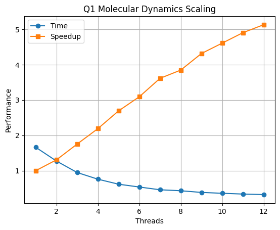
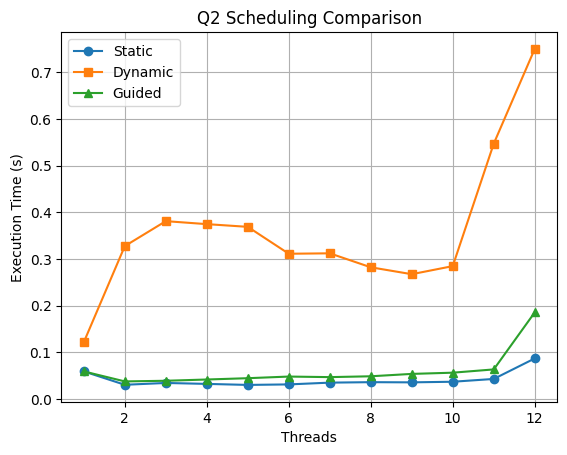
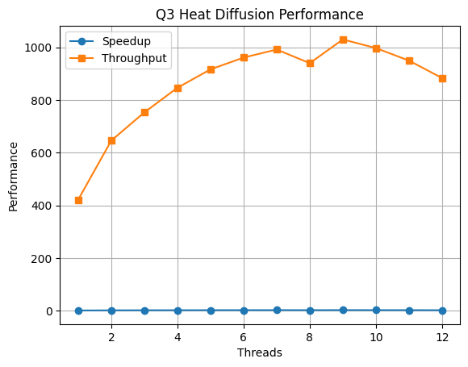

# Lab 2 — Parallel Performance Experiments using OpenMP

**Course:** UCS645 — Parallel & Distributed Computing
**Platform:** AMD Ryzen 5 5500U (6 cores / 12 threads)
**Environment:** Linux (WSL)

---

# Experiment 1 — Molecular Dynamics Kernel (Strong Scaling)

## Objective

Evaluate how a compute-intensive nested molecular interaction kernel scales with increasing OpenMP threads while keeping total workload fixed.

---

## Results

| Threads | Time (s) | Speedup | Efficiency |
| ------- | -------- | ------- | ---------- |
| 1       | 1.6619   | 1.00    | 1.00       |
| 2       | 1.2724   | 1.31    | 0.66       |
| 4       | 0.7591   | 2.19    | 0.55       |
| 6       | 0.5377   | 3.09    | 0.52       |
| 8       | 0.4322   | 3.85    | 0.48       |
| 12      | 0.3241   | 5.13    | 0.43       |

---

## Observations

* Moving from **1 → 2 threads**, execution time drops noticeably because independent loop iterations are parallelized. Speedup improves, but efficiency is already below 100% due to thread management overhead.

* At **4 threads**, the kernel shows strong scaling. Multiple cores execute pairwise calculations concurrently. Efficiency drops slightly because threads compete for shared memory bandwidth.

* At **6 threads**, speedup continues to grow, but gains begin slowing. Memory access latency and cache pressure increase as more threads request shared data.

* At **8 threads**, performance still improves, but efficiency declines further. Hyper-threading helps throughput, yet synchronization overhead becomes more visible.

* At **12 threads**, speedup increases modestly while efficiency drops. The workload becomes partially memory-bound, limiting perfect scaling.

Overall, this kernel scales well because computation dominates, but shared memory contention prevents linear speedup.

---

## Graph

---

## Interpretation

The workload benefits from parallel execution because interactions are largely independent. Scaling is limited by synchronization overhead and memory bandwidth — classic strong scaling behavior in shared-memory systems.

---

---

# Experiment 2 — Smith–Waterman DNA Alignment (Scheduling Study)

## Objective

Analyze how OpenMP scheduling strategies influence a dependency-aware wavefront dynamic programming algorithm.

---

## Static Scheduling

| Threads | Time (s) | Speedup | Efficiency |
| ------- | -------- | ------- | ---------- |
| 1       | 0.0592   | 1.00    | 1.00       |
| 2       | 0.0306   | 1.94    | 0.97       |
| 4       | 0.0325   | 1.82    | 0.46       |
| 6       | 0.0314   | 1.89    | 0.32       |
| 8       | 0.0362   | 1.63    | 0.20       |
| 12      | 0.0870   | 0.68    | 0.06       |

### Static Observations

* At low threads, static scheduling is efficient because work distribution has minimal overhead.
* As threads increase, diagonal dependencies limit parallel execution.
* Efficiency drops because threads idle while waiting for wavefront completion.
* At high thread counts, scheduling imbalance dominates, reducing speedup.

---

## Dynamic Scheduling

| Threads | Time (s) | Speedup | Efficiency |
| ------- | -------- | ------- | ---------- |
| 1       | 0.1219   | 1.00    | 1.00       |
| 2       | 0.3276   | 0.37    | 0.18       |
| 4       | 0.3746   | 0.33    | 0.08       |
| 6       | 0.3112   | 0.39    | 0.07       |
| 8       | 0.2822   | 0.43    | 0.05       |
| 12      | 0.7498   | 0.16    | 0.01       |

### Dynamic Observations

* Dynamic scheduling introduces high runtime overhead.
* Dependency constraints reduce parallel opportunities.
* Thread coordination cost exceeds useful computation.
* Scaling becomes inefficient as scheduling overhead dominates.

---

## Guided Scheduling

| Threads | Time (s) | Speedup | Efficiency |
| ------- | -------- | ------- | ---------- |
| 1       | 0.0592   | 1.00    | 1.00       |
| 2       | 0.0378   | 1.57    | 0.78       |
| 4       | 0.0419   | 1.41    | 0.35       |
| 6       | 0.0482   | 1.23    | 0.21       |
| 8       | 0.0488   | 1.21    | 0.15       |
| 12      | 0.1856   | 0.32    | 0.03       |

### Guided Observations

* Guided scheduling balances overhead and workload better than dynamic.
* Dependency limits still restrict concurrency.
* Efficiency declines as threads exceed available wavefront parallelism.

---

## Graph

---

## Interpretation

Wavefront dependencies restrict scalable parallelism. Scheduling overhead becomes dominant as thread count rises, showing that algorithm structure determines achievable performance.

---

---

# Experiment 3 — Heat Diffusion Simulation

## Objective

Evaluate spatial OpenMP stencil parallelization using execution time, speedup, efficiency, and throughput.

---

## Static Scheduling

| Threads | Time   | Speedup | Efficiency | Throughput |
| ------- | ------ | ------- | ---------- | ---------- |
| 1       | 1.8938 | 1.00    | 1.00       | 421.58     |
| 2       | 1.2363 | 1.53    | 0.77       | 645.79     |
| 4       | 0.9435 | 2.01    | 0.50       | 846.19     |
| 6       | 0.8310 | 2.28    | 0.38       | 960.72     |
| 8       | 0.8498 | 2.23    | 0.28       | 939.48     |
| 12      | 0.9041 | 2.09    | 0.17       | 883.07     |

### Static Observations

* Early scaling shows strong gains due to independent grid updates.
* Memory bandwidth pressure increases with threads.
* Efficiency declines as cache contention grows.

---

## Dynamic Scheduling

| Threads | Time   | Speedup | Efficiency | Throughput |
| ------- | ------ | ------- | ---------- | ---------- |
| 1       | 1.9392 | 1.00    | 1.00       | 411.71     |
| 2       | 1.4179 | 1.37    | 0.68       | 563.10     |
| 4       | 1.2461 | 1.56    | 0.39       | 640.71     |
| 6       | 0.9632 | 2.01    | 0.34       | 828.87     |
| 8       | 0.8848 | 2.19    | 0.27       | 902.31     |
| 12      | 0.9231 | 2.10    | 0.18       | 864.95     |

### Dynamic Observations

* Load balancing improves mid-range scaling.
* Overhead prevents ideal speedup.
* Memory access contention dominates at higher threads.

---

## Guided Scheduling

| Threads | Time   | Speedup | Efficiency | Throughput |
| ------- | ------ | ------- | ---------- | ---------- |
| 1       | 1.8957 | 1.00    | 1.00       | 421.16     |
| 2       | 1.2686 | 1.49    | 0.75       | 629.38     |
| 4       | 0.9364 | 2.02    | 0.51       | 852.59     |
| 6       | 0.8173 | 2.32    | 0.39       | 976.82     |
| 8       | 0.7601 | 2.49    | 0.31       | 1050.46    |
| 12      | 0.9258 | 2.05    | 0.17       | 862.36     |

### Guided Observations

* Guided scheduling achieves best mid-range scaling.
* Throughput peaks before memory saturation.
* Efficiency falls once bandwidth becomes limiting.

---

## Graph

---

## Interpretation

The stencil workload parallelizes effectively but becomes memory-bound as concurrency rises. Scheduling affects how efficiently memory bandwidth is utilized.

---

---

# Overall Discussion

* Compute-heavy workloads scale better than dependency-bound algorithms.
* Scheduling overhead and memory bandwidth limit scalability.
* Efficiency naturally declines as thread contention increases.

---

# Conclusion

OpenMP parallelization delivers strong acceleration, but real-world scaling is governed by algorithm structure, synchronization overhead, and memory behavior.

---
